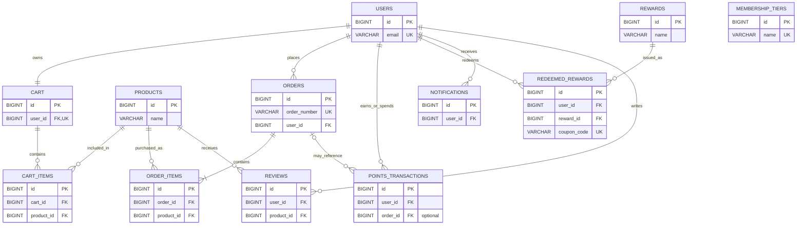

# Customer Loyalty Points System

A full-stack Java/Spring Boot demonstration storefront where customers shop, earn loyalty points, progress through membership tiers, and redeem rewards. An admin area supports basic customer, product, reward, and notification management.

## Project Overview

| Item | Description |
|---|---|
| Project type | Full-stack loyalty and e-commerce web application |
| Goal | Demonstrate customer shopping, loyalty-point earning, tier progression, and reward redemption |
| Customer flow | Register/sign in → browse products → manage cart → simulated checkout → earn points → redeem coupons |
| Admin flow | Review customers and manage products, rewards, and notifications |
| Architecture | Browser UI → REST API → service layer → JPA repositories → relational database |
| Persistence | MySQL stores accounts, catalog, carts, orders, points activity, rewards, reviews, and notifications |

## Features

- Customer registration, sign-in, profile, and password change
- Product catalog with search/category browsing, product details, cart, and simulated checkout
- Purchase points, first-purchase/referral/review/birthday bonuses, and points history
- Bronze, Silver, Gold, Platinum, and Diamond membership tiers
- Discount, percentage, gift-voucher, and free-delivery rewards with expiring coupons
- Customer notifications and product reviews
- Admin overview, customer search, product/reward management, and notification broadcast

## Technology Stack

| Layer | Technology | Purpose |
|---|---|---|
| Language | Java 21 | Backend implementation |
| Application framework | Spring Boot 3.3.4 | Application startup and dependency configuration |
| Web/API | Spring Web / Spring MVC | REST endpoints and static content serving |
| Persistence API | Spring Data JPA | Repository abstraction for database access |
| ORM | Hibernate | Maps Java entities to relational tables and executes generated SQL |
| Database | MySQL | Persistent application data |
| Database connectivity | MySQL Connector/J (JDBC) | JDBC driver used by Hibernate to communicate with MySQL |
| Frontend | HTML, CSS, JavaScript | Customer and admin pages, interactions, and API requests |
| Build | Maven Wrapper | Dependency management, compilation, and application launch |
| Other libraries | Jakarta Validation, BCrypt, H2 | Request validation, password hashing, and optional test datasource |

Request flow: **Browser → REST controller → service/business logic → Spring Data repository → Hibernate/JDBC → MySQL**.

## Requirements

- JDK 21 or a compatible newer JDK
- MySQL Server running locally
- A local MySQL database configured for the application

## Run on Windows

Start MySQL, configure the application's database connection locally, then open PowerShell in the project root and run Spring Boot:

```powershell
.\mvnw.cmd spring-boot:run
```

Open `http://localhost:8080`. Keep the terminal running while using the site. If port 8080 is already occupied, use another port:

```powershell
$env:SERVER_PORT = '8081'
.\mvnw.cmd spring-boot:run
```

Then visit `http://localhost:8081`.

## Database

The application uses MySQL for persistent data. Its datasource settings are in `src/main/resources/application.properties`; configure the connection for your local environment without adding credentials to this README or committing them to source control. Hibernate updates mapped tables at application startup. To inspect data in MySQL Workbench, open the application's schema and query tables such as `users`, `orders`, `order_items`, `points_transactions`, `rewards`, and `redeemed_rewards`.

> **Warning:** `loyalty_db.sql` is a standalone schema/seed script that drops existing tables before recreating them. Do not run it against a database whose data you need to preserve.

## Entity Relationship Diagram

The diagram shows the main persisted entities and their foreign-key relationships. `membership_tiers` is looked up by point balance in application logic and has no foreign key to `users`.



## Loyalty rules

- Purchase points default to `round(final order amount × 10%)`; configure with `loyalty.points.earn-rate`.
- The first completed purchase bonus defaults to 200 points.
- Birthday bonus defaults to 100 points; it is available on the customer's saved birthday and may be claimed once per calendar year.
- Referral bonus defaults to 150 points; review bonus defaults to 25 points.
- Tiers are selected by current point balance: Bronze 0–199, Silver 200–499, Gold 500–999, Platinum 1,000–1,999, and Diamond 2,000+.
- Silver/Gold/Platinum/Diamond discounts are 2%/5%/8%/10%. Gold and higher tiers include free delivery.
- Standard delivery is ₹100 below ₹1,000 unless the tier or a coupon provides free delivery.

Values are seeded in `DataInitializer.java`; check that class and service implementations for the exact active behavior.

## Pages and API

Customer pages include `index.html`, `login.html`, `register.html`, `dashboard.html`, `products.html`, `product-details.html`, `cart.html`, `checkout.html`, `order-confirmation.html`, `rewards.html`, `my-rewards.html`, `points-history.html`, `profile.html`, and `notifications.html`. Admin pages are `admin-login.html`, `admin-dashboard.html`, `admin-customers.html`, `admin-products.html`, `admin-rewards.html`, and `admin-notifications.html`. All static pages are under `src/main/resources/static`.

REST endpoints are rooted at `/api`:

- `/auth` — customer registration and customer/admin login
- `/products` — catalog, product detail, and categories
- `/cart` — cart summary and item operations
- `/orders` — simulated checkout and order history/details
- `/customer` — dashboard, profile, points history, tiers, and birthday bonus
- `/rewards` — active rewards, redemption, and customer coupons
- `/notifications` — list, unread count, and read-state updates
- `/reviews` — product reviews
- `/admin` — summary, customer lookup, products, rewards, and notifications

See controller classes in `src/main/java/com/loyalty/system/controller` for individual HTTP methods, paths, and request fields.

## Demo accounts

Created by `DataInitializer` only when the accounts do not already exist:

- Customer: `customer@loyalty.com` / `customer123`
- Admin: `admin@loyalty.com` / `admin123`

## Project layout

```text
src/main/java/com/loyalty/system/
  config/       Startup data and password encoder
  controller/   REST endpoints
  dto/          API request/response objects
  model/        JPA entities
  repository/   Spring Data repositories
  service/      Business rules and persistence workflows
src/main/resources/
  application.properties
  static/       HTML, CSS, and JavaScript frontend
pom.xml
mvnw.cmd
loyalty_db.sql
```

## Build

```powershell
.\mvnw.cmd -q -DskipTests compile
```

## Demo limitations and security

Checkout records a simulated payment; no payment provider is integrated. BCrypt hashes account passwords, but the current browser-side login state and user-ID-based APIs do not provide production-grade server-side authentication/authorization. Use only for local demonstration; before deployment, add server-enforced authentication and role checks, a least-privilege database account, HTTPS, and versioned schema migrations.
